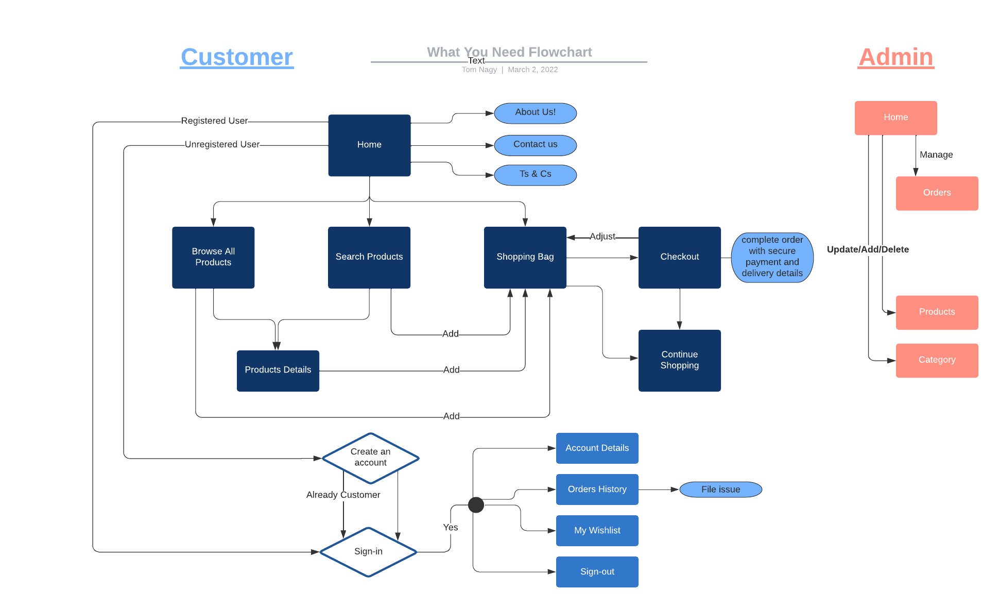

# **What You Need** :seedling:

**What You Need** is an e-commerce web application that propose a range of indoor and outdoor plants to make your home or office healthier and a bit more special.  
This project is build with growth in mind and offer opportunities to add and improve features as the business develops.

For this project the use of Stripe's test functionality is implemented, rather than actual live payments.
You can make test payment with the following details:

| NUMBER                | BRAND            | CVC          | DATE            |
| --------------------- |----------------- | ------------ | --------------- |
| 4242424242424242      | Visa             | Any 3 digits | Any future date |
| 5555555555554444      | Mastercard       | Any 3 digits | Any future date |
| 378282246310005       | American Express | Any 4 digits | Any future date |

Visit the live Website : **[What You Need :arrow_right:](website link)**

## Table of Content

* [Project](#Project)
  * [Project Goals](#Project-Goals)
  * [Developer and Business Goals](#Developer-and-Business-Goals)
  * [User Goals](#User-Goals)
* [UX](#UX)
  * [Audience Definition](#Audience-Definition)
  * [User Stories](#User-Stories)
  * [Design Choices](#Design-Choices)
  * [Wireframes](#Wireframes)
  * [Different Design](#Different-Design)
* [Features](#Features)
* [Flowchart](#Flowchart)
* [Database](#Database)
  * [Database Design](#Database-Design)
  * [Database Structure](#Database-Structure)
* [Code Structure/Organisation](#Code-Structure/Organisation)
* [Technologies Used](#Technologies-Used)
* [Testing](#Testing) [:fast_forward: TESTING.md](TESTING.md)
* [Deployment](#Deployment) [:fast_forward: DEPLOYMENT.md](DEPLOYMENT.md)
  * [Get Started](DEPLOYMENT.md#Get-Started)
    * [Cloning](DEPLOYMENT.md#Cloning)
    * [Forking](DEPLOYMENT.md#Forking)
    * [Installations and dependencies](DEPLOYMENT.md#Installations-and-dependencies)
  * [Live Deployment](DEPLOYMENT.md#Live-Deployment)
    * [Create the Heroku app](DEPLOYMENT.md#Create-the-Heroku-app)
    * [Set up AWS s3 to host our static files and images](DEPLOYMENT.md#Set-up-AWS-s3-to-host-our-static-files-and-images)
    * [Connect Django to s3](DEPLOYMENT.md#Connect-Django-to-s3)
    * [Add Media folder to our bucket](DEPLOYMENT.md#Add-Media-folder-to-our-bucket)
    * [Final Steps](DEPLOYMENT.md#Final-Steps)
* [Bugs](#Bugs)
* [Credits](#Credits)
  * [Content](#Content)
  * [Acknowledgements](#Aknowledgements)

## Project

### Project Goals

What You Need is an MVP(Model View Project) build for educational purposes that promotes green and healthy homes and offices.

In this year 2022 we can observe a shift in lifestyles needs and organisation. People that use to spend most of their time at work, now work part or full-time from home. And in general people are more aware of their direct environment.

One of today's challenges is mental health. People are more conscious about it, and they are looking for ways to improve their mental health. They want to feel good or better about themselves and about what they do.

Research prove that plants and natural elements provide a positive impact on people increasing well-being and productivity.  
This creates a market opportunity for helping customers improving their workspace and home. At the same time, the e-commerce market is expanding with more people using the web to get what they need every day.

In response to this demand, **What You Need** online shop offers a wide variety of plants. From the most delicate plants to the most indestructible. Customer can browse the website catalog by sorting or searching for specific categories, deals and plants.  
Registered and logged in customer will benefit of the full functionalities of the website including save items into a wishlist, ratings products and leaving reviews as well as reviewing their past order and making request about an order with ease and confidence. Registered customer will have exclusive access to specially selected plants. So get what you need today!

As a site owner you can manage your products. You can add, delete and update products. You have the option to make a product on sale, and it will be populated added to the relevant category. As well the availability of stock is automated and products will be available to buy only if in stock. The product management page will display the products out of stock as well as the products within that reach a critical stock in order for you to keep track of your inventory and place an order if necessary.

### Developer and Business Goals

* Develop a viable e-commerce web application.
* Provide a user-friendly interface.
* Provide an amazing user-experience across multiple device sizes.
* Improve Wellness and health.

### User Goals

* Easy to use application.
* Getting clear information.
* Quick access to products.
* Buy plants for their homes or offices.

[**:back:** *Table of Content*](#Table-of-Content)

## UX

### Audience definition

1. The primary targeted audience is very broad and address all **online customers**.
2. The secondary targeted audience is **Corporates or Businesses**.

Both targeted audience are looking for plants to buy for their home, office(s) or business. They can be considered as one. The difference will reside in the quantity needed. This is managed with specials deals category for larger orders.

### User stories

#### Customer stories

##### Website navigation and browsing

1. As a user, I want a user-friendly, simple and interactive website.
2. As a user, I want to be able to access the website on different devices with the same experience.
3. As a user, I want to find out what is the website purposes.
4. As a user, I want to search products by category.
5. As a user, I want to search for specific products.
6. As a user, I want to see more details about a product.

##### Shopping experience

1. As a customer, I want to easily identify what is the price of the product.
2. As a customer, I want to easily identify if the product is available.
3. As a customer, I want to choose the size and quantity of a product.
4. As a customer, I want to add/remove/edit product(s) in my shopping bag.
5. As a customer, I want to easily access my shopping bag.
6. As a customer, I want to make a purchase.
7. As a customer, I want the purchase process to be easy and secure.
8. As a customer, I want to be notified of the purchase I have made and be provided with a receipt.
9. As a customer, I want to contact the website owner about a past order.

##### Sign-in and registration

1. As a user, I want to create an account.
2. As registered user, I want to sign-in and sign-out easily.
3. As registered user, I want to change my password if forgotten or not safe anymore.
4. As signed-in user, I want to save/update information to my profile for a better and easier experience.
5. As signed-in user, I want to save products I like for a future purchase.
6. As signed-in user, I want to see/edit my wishlist.
7. As signed-in user, I want to access my previous orders.
8. As signed-in user, I want to leave a review on a product.

#### Site owner/Admin stories

1. As an Admin, I want to add/edit/delete products.
2. As an Admin, I want to add/edit/delete categories.
3. As an Admin, I want to see orders.
4. As an Admin, I want to manage customer queries.

[**:back:** *Table of Content*](#Table-of-Content)

### Design Choices

The approach concerning design choices is that the UX (User experience) should be the same across all platform and devices. Consistency being a key factor for UX.  
For this reason the UI (User Interface) is kept the same across different device sizes. This does not exclude the consideration for any extra or different features, should it improve the user experience.

#### Fonts

Considering the targeted audience, the sans serif type of font is the more appropriate because it is most often associated with simplicity and straightforwardness.  

The website will use well known and popular font that are used online in order to bring to the user a "feeling of knowing".

* *Poppins* for headings.

* *Lato* for main content.

*Sans serif* will be use as a fall back if the fonts do not load. It is common as the main typographies are sans serif type.

#### Icons

* Some Font Awesome icons will be part of the website for better UX.
* The [logo](documentation/logo/logo.png) and [favicon](documentation/favicon/favicon.ico) are the same image and use the color scheme of the website.

#### Colors

The colours chosen for the website are simple and joyful. They are based on the psychology behind colours ([colour affects](http://www.colour-affects.co.uk/psychological-properties-of-colours), [London Image Institute](https://londonimageinstitute.com/how-to-empower-yourself-with-color-psychology/)).

[Adobe Color](https://color.adobe.com) was used to build the colour scheme, compatibility and accessibility. The color scheme and swatches are said color-blind safe.

#### Images

The images will be the one uploaded by website owner and/or Admin for products descriptions and website illustrations.  

MAYBE IMAGES WILL BE UPLOADED USING A DATA FROM A WEBSITE 111111111111111111

#### Styling/Feeling

The feel of the website is welcoming and simple to provide a quick access and learning process.  
It makes users comfortable.

#### Audio/Video

No audio or video will be integrated at the moment.

[**:back:** *Table of Content*](#Table-of-Content)

### Wireframes

* [Home page](documentation/wireframes/home.pdf)
* [About page](documentation/wireframes/about.pdf)
* [Contact page](documentation/wireframes/contact.pdf)
* [Terms and Conditions of use page](documentation/wireframes/t-c.pdf)
* [Sign-in page](documentation/wireframes/signin.pdf)
* [create an account page](documentation/wireframes/create-account.pdf)
* [Products page](documentation/wireframes/products.pdf)
* [Product details page](documentation/wireframes/product-details.pdf)
* [Search page](documentation/wireframes/search.pdf)
* [Orders history page](documentation/wireframes/orders-history.pdf)
* [Order details page](documentation/wireframes/order-details.pdf)
* [Order issue page](documentation/wireframes/order-issue.pdf)
* [Account details page](documentation/wireframes/account-details.pdf)
* [Wishlist page](documentation/wireframes/wishlist.pdf)
* [Bag page](documentation/wireframes/bag.pdf)
* [Checkout page](documentation/wireframes/checkout.pdf)
* [Add product page](documentation/wireframes/add-product.pdf)
* [Add category page](documentation/wireframes/add-category.pdf)
* [Error page](documentation/wireframes/error-page.pdf)

For the full version:

* [What You Need website](documentation/wireframes/what-you-need.pdf)

[**:back:** *Table of Content*](#Table-of-Content)

### Different design

After considering deadline and features priority, I decided to leave the support section for future features to implement. I once heard that the project is never finished, we just run out of time!

[**:back:** *Table of Content*](#Table-of-Content)

## Features

To build this project, I use Django framework with the Jinja templating language. For consistency across the website some features will be repeated and functionality will be kept as simple and direct as possible.

* Navigation is always present and fix at the bottom of the page
  * Home
  * Account/profile
  * Bag
  * Search

* Browse product
  * By clicking the callout button on the landing page
  * By clicking the search menu button/icon
  * By category
  * By typing in the search bar

* Shopping bag
  * View the shopping bag
  * Add products to the bag
  * Remove/edit products in the bag

* Checkout
  * Purchase item securely with Stripe payment system
  * Save delivery information
  * Payment confirmation
  * Order confirmation

* Account/Profile
  * Create an account
  * Sign-in and sign-out
  * Update account information
  * Change password if forgotten or unsecure
  * Access orders history
  * File issue regarding an order
  * Access and update wishlist

[**:back:** *Table of Content*](#Table-of-Content)

## Flowchart

[**:back:** *Table of Content*](#Table-of-Content)

## Database

### Database design

The database design used is a relational database.

* During **development**, sqlite3 was used. It is the database provided by Django and only use for development.
* For **Production**, Postgres is used. It is the database provided by Heroku when deploying the website live.

Below is a representation of the database used for this project.

* The Category model **must** have a name, friendly name and a boolean field for registered user and the other fields are optional.
* The Product model **must** have a category, name, friendly_name ................................................. 

### Database Structure

Django, the framework used for the production of this project, is an MVP: Model View Product/Project ??????? This means that the project build with Django is divided in multiple apps. Its structure allows separation of concern and provide many built-in features.  
The models define the data-structure.

* In this project, the following models have been developed:
  * Product
  * Category
  * Order
  * OrderLineItem
  * OrderIssue
  * User
  * UserAccount
  * Review
They can be grouped into three main models : Product, Order, UserAccount

* Models relationship:
  * Product :left_right_arrow: Category: **Many to Many**
    * A Product can be related to many Category, and a Category can be related to many Product.
  
  * Product :left_right_arrow: OrderLineItem: **Many to One**
    * A Product can be related to many OrderLineItem, but an OrderLineItem can be related to one Product.
  
  * Product :left_right_arrow: Review: **Many to One**
    * A Product can be related to many Review, but a Review can be related to one Product.
  
  * Order :left_right_arrow: UserAccount: **One to Many**
    * A Order can be related to one UserAccount, but a UserAccount can be related to many Order.
  
  * Order :left_right_arrow: OrderLineItem: **Many to One**
    * An Order can be related to many OrderLineItem, but an OrderLineItem can be related to one Order.
  
  * Order :left_right_arrow: OrderIssue: **Many to One**
    * An Order can be related to many OrderIssue, but an OrderIssue can be related to one Order.
  
  * UserAccount :left_right_arrow: Review: **Many to One**
    * A UserAccount can be related to many Review, but a Review can be related to one UserAccount.
  
  * UserAccount :left_right_arrow: User: **One to One**
    * A UserAccount can be related to one User, and a User can be related to one UserAccount.
  
  * UserAccount :left_right_arrow: OrderIssue: **Many to One**
    * An UserAccount can be related to many OrderIssue, but an OrderIssue can be related to one UserAccount.

## Technologies Used

### Programming Languages

This project was developed using:

* HTML
* CSS
* JavaScript
* Python
* Jinja templating language.

### Frameworks, Libraries and Programs

* [Django](https://www.djangoproject.com/)  
Framework used to develop the website.

* [Balsamiq](https://balsamiq.com/wireframes/)  
For creating wireframes.

* [Lucichart](https://www.lucidchart.com/)  
For producing the flowchart and database design.

* [Google Fonts](https://fonts.google.com/)  
For importing fonts.

* [favicon.io](https://favicon.io/favicon-converter/)  
For generating the favicon.

* [TinyPNG](https://tinypng.com/) or [Squoosh](https://squoosh.app/)  
For resizing all the images.

* [BeFunky](https://www.befunky.com/create/)
For cropping some images.

* [Adobe Color](https://color.adobe.com/create/image)  
For extracting the color scheme used on the website.

* [Am I Responsive?](http://ami.responsivedesign.is/?url=http://ami.responsivedesign.is/#)  
For providing screenshots of the responsiveness of the website across several devices.

* [Autoprefixer CSS online](https://autoprefixer.github.io/)  
For adding prefixer in style.css for cross browser compatibility.

* [Git](https://git-scm.com/)  
For Version control.

* [GitPod](https://www.gitpod.io/)  
For Integrated Development Environment.

* [GitHub](https://github.com/)  
For hosting the repository.

* [Heroku](https://www.heroku.com/home)  
For deploying the website live.

[**:back:** *Table of Content*](#Table-of-Content)

## Testing

Testing information are published in a separate file for better readability.
Please see [TESTING.md](TESTING.md).

## Deployment

Deployment information are published in a separate file for better readability.  
Please see [DEPLOYMENT.md](DEPLOYMENT.md)

This project is developed on [Gitpod Workspaces IDE](https://www.gitpod.io/) (Integrated Development Environment) committed and pushed to [GitHub](https://github.com), to [my Repository](https://github.com/Tom-Nagy/what-you-need) using Gitpod Command Line Interface (CLI) with [Git version control](https://git-scm.com/).

The project is deployed on Heroku using Postgres database and linked to s3 bucket cloud service on AWS (Amazon Wed Services) for hosting the media and image files.

### Deployment content

* [DEPLOYMENT.md](DEPLOYMENT.md)
  * [Get Started](DEPLOYMENT.md#Get-Started)
    * [Cloning](DEPLOYMENT.md#Cloning)
    * [Forking](DEPLOYMENT.md#Forking)
    * [Installations and dependencies](DEPLOYMENT.md#Installations-and-dependencies)
  * [Live Deployment](DEPLOYMENT.md#Live-Deployment)
    * [Create the Heroku app](DEPLOYMENT.md#Create-the-Heroku-app)
    * [Set up AWS s3 to host our static files and images](DEPLOYMENT.md#Set-up-AWS-s3-to-host-our-static-files-and-images)
    * [Connect Django to s3](DEPLOYMENT.md#Connect-Django-to-s3)
    * [Add Media folder to our bucket](DEPLOYMENT.md#Add-Media-folder-to-our-bucket)
    * [Final Steps](DEPLOYMENT.md#Final-Steps)

## Bugs

## Credits

### Code

* For sorting a list and returning a list:
  * With the answer of venpa from [Stackoverflow post](https://stackoverflow.com/questions/22117834/how-do-i-return-a-list-of-the-3-lowest-values-in-another-list)

### Content

* From [depositphotos](https://depositphotos.com/)
  * Home page photo:
    * By vectordreamsmachine [House flowers indoor floriculture round pattern vector illustration. Nature home decoration gardening. Indoor plants in flowerpot beauty decorative flora. Cozy succulent foliage exotic garden — Vector](https://depositphotos.com/274525976/stock-illustration-house-flowers-indoor-floriculture-round.html)

  * Potted plant pictures for product images:
    * By Igor_Vkv [Houseplant Ficus Elastica — Photo](https://depositphotos.com/116944292/stock-photo-houseplant-ficus-elastica.html)
    * By maxim1717 [Gloxinia on a white background — Photo](https://depositphotos.com/152370622/stock-photo-gloxinia-on-a-white-background.html)
    * By wildman [Beautiful red poinsettia plant isolated on white — Photo](https://depositphotos.com/5599174/stock-photo-beautiful-red-poinsettia-plant-isolated.html)
    * By wildman [Window plant "Nephrolepis exaltata" — Photo](https://depositphotos.com/5045073/stock-photo-window-plant-nephrolepis-exaltata.html)
    * By wildman [Window plant "Syngonium podophyllum" — Photo](https://depositphotos.com/4481094/stock-photo-window-plant-syngonium-podophyllum.html)
    * [Cyclamen plant — Photo](https://depositphotos.com/4494293/stock-photo-cyclamen-plant.html)
    * By wildman [Home plant begonia on white background — Photo](https://depositphotos.com/4478061/stock-photo-home-plant-begonia-on-white.html)
    * By olesiabilkei [Family of young potted citrus plants isolated on white. top view — Photo](https://depositphotos.com/13550647/stock-photo-family-of-young-potted-citrus.html)
    * By Tamara_k [Rubber plant (ficus), isolated on white — Photo](https://depositphotos.com/6311132/stock-photo-rubber-plant-ficus-isolated-on.html)

* Potted plant photo by [Kelsey Brown](https://unsplash.com/@kelseybrownart?utm_source=unsplash&utm_medium=referral&utm_content=creditCopyText) on [Unsplash](https://unsplash.com/collections/z3tT15aKtnE/ms4?utm_source=unsplash&utm_medium=referral&utm_content=creditCopyText)

* From [stock adobe](https://stock.adobe.com):
  * Potted plant pictures for product images:
    * By fotoslaz (dieffenbachia camilla) [Green houseplant isolated](https://stock.adobe.com/ie/images/green-houseplant-isolated/169438030?prev_url=detail)  
    * By taviphoto [Ulmus parvifolia, chinese elm in training](https://stock.adobe.com/ie/images/ulmus-parvifolia-chinese-elm-in-training/291330158?prev_url=detail)
    * By Grafvision [Viola wittrockiana flowers](https://stock.adobe.com/ie/images/viola-wittrockiana-flowers/383430009?prev_url=detail)
    * By Grafvision [Cyclamen curly chrysanthemum flower](https://stock.adobe.com/ie/images/cyclamen-curly-chrysanthemum-flower/382197293?prev_url=detail)
    * By Yurii [palm tree in a pot](https://stock.adobe.com/ie/images/palm-tree-in-a-pot/226757428?prev_url=detail)
    * By Yurii [palm trees in a pot](https://stock.adobe.com/ie/images/palm-trees-in-a-pot/214633879?prev_url=detail)
    * By Yurii [schefflera arboricola in pot](https://stock.adobe.com/ie/images/schefflera-arboricola-in-pot/222473486?prev_url=detail)
    * By Yurii [Buxus sempervirens in pot](https://stock.adobe.com/ie/images/buxus-sempervirens-in-pot/220679914?prev_url=detail)
    * By Yurii [small coconut tree in a pot](https://stock.adobe.com/ie/images/small-coconut-tree-in-a-pot/227054457?prev_url=detail)
    * By Yurii [Chlorophytum in a black pot isolated on white background](https://stock.adobe.com/ie/images/chlorophytum-in-a-black-pot-isolated-on-white-background/367125088?prev_url=detail)
    * By Yurii [Monstera in a clay pot on a white background](https://stock.adobe.com/ie/images/monstera-in-a-clay-pot-on-a-white-background/312225408?prev_url=detail)
    * By Yurii [mandarin Tree with Fruit](https://stock.adobe.com/ie/images/mandarin-tree-with-fruit/386949158?prev_url=detail)
    * By Yurii [Croton in pot. Exotic plants](https://stock.adobe.com/ie/images/croton-in-pot-exotic-plants/222477856?prev_url=detail)
    * By Yurii [Exotic plants in pot Tradescantia zebrina](https://stock.adobe.com/ie/images/exotic-plants-in-pot-tradescantia-zebrina/269200300?prev_url=detail)
    * By Yurii [Spathiphyllum in pot](https://stock.adobe.com/ie/images/spathiphyllum-in-pot/220117988?prev_url=detail)
    * By Yurii [cactus in pot](https://stock.adobe.com/ie/images/cactus-in-pot/223147114?prev_url=detail)
    * By Maryana Volkova [Violet oxalis house plant and grey ceramic pot on the wooden table](https://stock.adobe.com/ie/images/violet-oxalis-house-plant-and-grey-ceramic-pot-on-the-wooden-table/281903357?prev_url=detail)
    * By Flower Studio [Thuja occidentalis danica isolated on white background. Coniferous trees](https://stock.adobe.com/ie/images/thuja-occidentalis-danica-isolated-on-white-background-coniferous-trees/182904788?prev_url=detail)
    * By ozmen [Tomato plant with flowers in bucket isolated on white background](https://stock.adobe.com/ie/images/tomato-plant-with-flowers-in-bucket-isolated-on-white-background/231847030?prev_url=detail)
    * By de_nise [Zimmerpflanzen - Peperomia](https://stock.adobe.com/ie/images/zimmerpflanzen-peperomia/283407365?prev_url=detail)
    * By M. Schuppich [Sedum morganianum](https://stock.adobe.com/ie/images/sedum-morganianum/101795426?prev_url=detail)
    * By womue [Rosa Alpenveilchen](https://stock.adobe.com/ie/images/rosa-alpenveilchen/132134525?prev_url=detail)
  
  * For exclusive category image:
    * By Raman Maisei [Female hand hold a plant with a growing young shoot or sprout. Vintage engraving stylized drawing. Vector illustration](https://stock.adobe.com/ie/images/female-hand-hold-a-plant-with-a-growing-young-shoot-or-sprout-vintage-engraving-stylized-drawing-vector-illustration/437456996?prev_url=detail)
  
  * For indoor category image:
    * By artinspiring [Plants on shelf](https://stock.adobe.com/ie/images/plants-on-shelf/180623652?prev_url=detail)
  
  * For outdoor category image:
    * By Good Studio [Female cartoon character watering berry and vegetable plants growing in pots and planters isolated on white background](https://stock.adobe.com/ie/images/female-cartoon-character-watering-berry-and-vegetable-plants-growing-in-pots-and-planters-isolated-on-white-background/202905867?prev_url=detail)
  
  * For newly added category image:
    * By Raman Maisei [A plant with a growing young shoot or sprout in a pot, standing on the table. Vintage engraving stylized drawing. Vector illustration](https://stock.adobe.com/ie/images/a-plant-with-a-growing-young-shoot-or-sprout-in-a-pot-standing-on-the-table-vintage-engraving-stylized-drawing-vector-illustration/437022287?prev_url=detail)

  * For special deals category image:
    * By bsd studio [Seed money linear icon](https://stock.adobe.com/ie/images/seed-money-linear-icon/249294371?prev_url=detail)

  * For best seller category image:
    * By erix_ultrasonic [Recommended Thumbs up with a Star Logo Vector Icon Illustration](https://stock.adobe.com/ie/images/recommended-thumbs-up-with-a-star-logo-vector-icon-illustration/295457576?prev_url=detail)

  * For no pictures available:
    * By Kiselov [No Image Available icon. Missing image sign or no picture for web site or mobile app. Vector symbol](https://stock.adobe.com/ie/images/no-image-available-icon-missing-image-sign-or-no-picture-for-web-site-or-mobile-app-vector-symbol/429424279?prev_url=detail)

[W3schools](https://www.w3schools.com/)  

[W3docs](https://www.w3docs.com/)

[stack overflow](https://stackoverflow.com/)

[GeeksforGeeks](https://www.geeksforgeeks.org/)

[Net Lawman](https://www.netlawman.co.uk/d/website-privacy-policy)  
For privacy policy template.

### Acknowledgements

Special thanks to all Code Institute's team (“Teacher”, Lecturers and Tutors) that are making me more knowledgeable and are making this happen.

Huge thank you to the [Slack](code-institute-room.slack.com) community, all the members and all the leads and tutors for their help and support.

I am hugely grateful to my mentor Chris Quinn for guiding me through this project.

[**:back:** *Table of Content*](#Table-of-Content)
